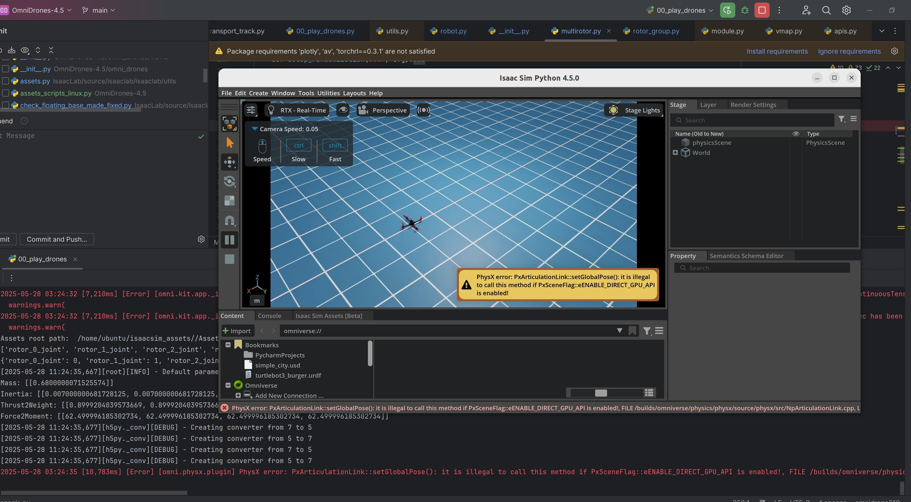

# OmniDrones

## Background Information

The original repository link is: [https://github.com/btx0424/OmniDrones](https://github.com/btx0424/OmniDrones)

The original repository supported Isaac Sim versions 2023 and 4.1.

In this repository, I have migrated it to Isaac Sim 4.5. It is recommended to use Ubuntu 22.04, as it simplifies the Isaac Sim installation process.

## Installation Method

Refer to the official `pip install` method: [https://isaac-sim.github.io/IsaacLab/main/source/setup/installation/pip_installation.html](https://isaac-sim.github.io/IsaacLab/main/source/setup/installation/pip_installation.html)

## Result


## Unresolved Issues

When running the following command:


```python
python examples/00_play_drones.py
```
The drones render correctly, but they are unable to fly.

