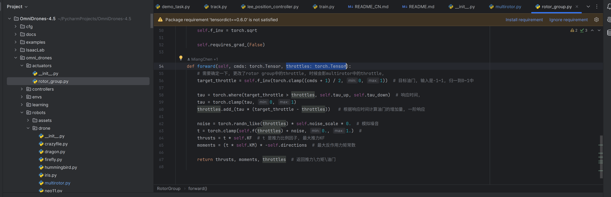

# OmniDrones

## 背景信息
源仓库的链接是: https://github.com/btx0424/OmniDrones
原来的仓库对isaacsim的支持是2023 和 4.1版本

在这个仓库中, 我将其迁移到了 isaacsim 4.5, 建议使用ubuntu22.04, 能够简化isaacsim的安装过程

## 安装方法
参考官方的pip install方法 https://isaac-sim.github.io/IsaacLab/main/source/setup/installation/pip_installation.html

## 效果


## 尚未解决的问题

运行

```python
python examples/00_play_drones.py
```

无人机可以渲染出来, 但是无法飞行


目前我对底层进行了一个修改, 调整了self.throttle的位置, 这两个文件分别是`omni_drones/robots/drone/multirotor.py`和`omni_drones/actuators/rotor_group.py`
但是尽管我将self.throttle设置为torch.tensor([[[1, 1, 1, 1]]]), 无人机也无法飞起来, 我不太确定到底是什么原因导致的



